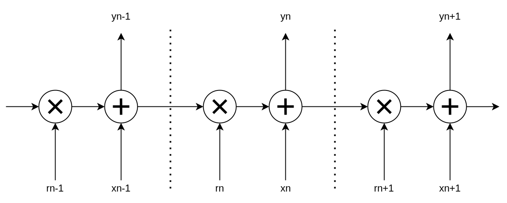

# SQRLL : Simplified Quasi-Recurrent Linear Layer

This is inspired by ideas from [QRNN](https://github.com/salesforce/pytorch-qrnn) ([Paper](https://arxiv.org/abs/1611.01576))

### SQRLL Kernel

The "simplification" of QRNN-Kernel here is the removal of the forget-gate multiplying with the input. One could easily pre-multiply the input to achieve the same behavior has QRNN, but you could also choose any other input gating scheme as well. Input gating is already parallelizable, and it's more flexible to keep it outside the custom cuda kernel anyway.



This repo includes a simple cuda kernel implementing the recurrent relation above (forward and backward) in a feature-parallel way. It's JIT compiled with `cupy` on demand. `float32`, `float16`, and `bfloat16` are all supported.

### SQRLL Layer

Taking inspiration from LSTM and RetNet, I added more "gates" to the sqrll layer compared to QRNN. The full layer impl is best explained by the code itself.

```py

class SqrllLayer(torch.nn.Module):
    def __init__(self, n_in, n_mem, n_out):
        super().__init__()
        self.wr = torch.nn.Linear(n_in, n_mem)
        self.wi = torch.nn.Linear(n_in, n_mem, bias=False)
        self.wig = torch.nn.Linear(n_in, n_mem)
        self.wog = torch.nn.Linear(n_in, n_mem)
        self.wo = torch.nn.Linear(n_mem, n_out, bias=False)

    def forward(self, x, mem=None):
        og = self.wog(x).sigmoid()
        r = self.wr(x).sigmoid()
        x = self.wi(x) * self.wig(x).sigmoid()

        y = sqrll_kernel(x, r, mem)
        mem = y[:,-1].detach().clone()
        
        y = torch.nn.functional.softsign(y)
        y = y * og
        y = self.wo(y)

        return y, mem
```

### SqrLLM Model

The original QRNN paper described a model alternating QRNN kernel and convolutional layers, with 1-hop skip connections.

I decided instead of start fresh here and follow the pattern of Transformers with all layers in residual side branches, and include up-projection MLP layers.

I also added a hyperparameter to insert MLP layers once every N `sqrll` layers, which can reduce parameter count.

### Torch to C++

SqrLLM models can be converted to pure c++ code with no dependencies, inlining the weights as constants in the code (bfloat16 storage format).

This means the model.cpp can be compiled to `WebAssembly` for example, where the file-size overhead beyond the weights is mere kilobytes!

A Makefile is including showing how to compile for both command-line and web assembly.

This component was designed in a general purpose way, using torch.fx to discover the model architecture. However only the bare minimal set of functions are implemented to get SqrLLM export working. Maybe some day I'll spend more time on it and break it out as a standalone tool.